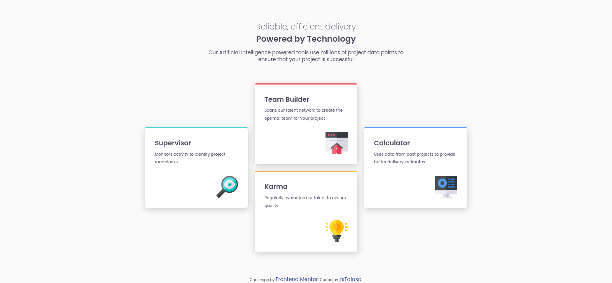

# FrontendMentor-Four-Cards-Feature-Section
Frontend Mentor challenge

# Frontend Mentor - Four card feature section solution

This is a solution to the [Four card feature section challenge on Frontend Mentor](https://www.frontendmentor.io/challenges/four-card-feature-section-weK1eFYK). Frontend Mentor challenges help you improve your coding skills by building realistic projects. 

## Table of contents

- [Overview](#overview)
  - [The challenge](#the-challenge)
  - [Screenshot](#screenshot)
  - [Links](#links)
- [My process](#my-process)
  - [Built with](#built-with)
  - [What I learned](#what-i-learned)
  - [Continued development](#continued-development)
- [Acknowledgments](#acknowledgments)


## Overview

### The challenge

Users should be able to:

- View the optimal layout for the site depending on their device's screen size

### Screenshot





### Links

- Solution URL: [Add solution URL here]([https://your-solution-url.com](https://github.com/TalasaDev/FrontendMentor-Four-Cards-Feature-Section/tree/main))
- Live Site URL: [Add live site URL here](https://your-live-site-url.com)

## My process

### Built with

- Semantic HTML5 markup
- CSS custom properties
- CSS Grid
- Mobile-first workflow


### What I learned

- How to center :
    - Using {margin: auto;} Must convert image first to a block element since is an inline element.
    - Using {display: flex;} Put the  element inside a <div> and apply justify-content: center.
    - Vertical - Horizontal aligment: using flex, with  inside of a <div>:

        ```html
        <div>
            
        </div>
        ```

        ```css
        display: flex;
        justify-content: center; /* centers horizontally */
        align-items: center;     /* centers vertically */
        height: 600px;
        ```
        ```css /* using grid */
        display: grid;
        place-items: center;
        ```


### Continued development

- Keep practising: grid layout and elements position.
- Next: SASS.


### Useful resources

- [Grid by Example](https://https:/gridbyexample.com/) - Excellent resource to learn and practice grid layout. 


## Author

- Frontend Mentor - [@TalasaDev](https://www.frontendmentor.io/profile/TalasaDev)
- Twitter - [@yourusername](https://www.twitter.com/yourusername)


